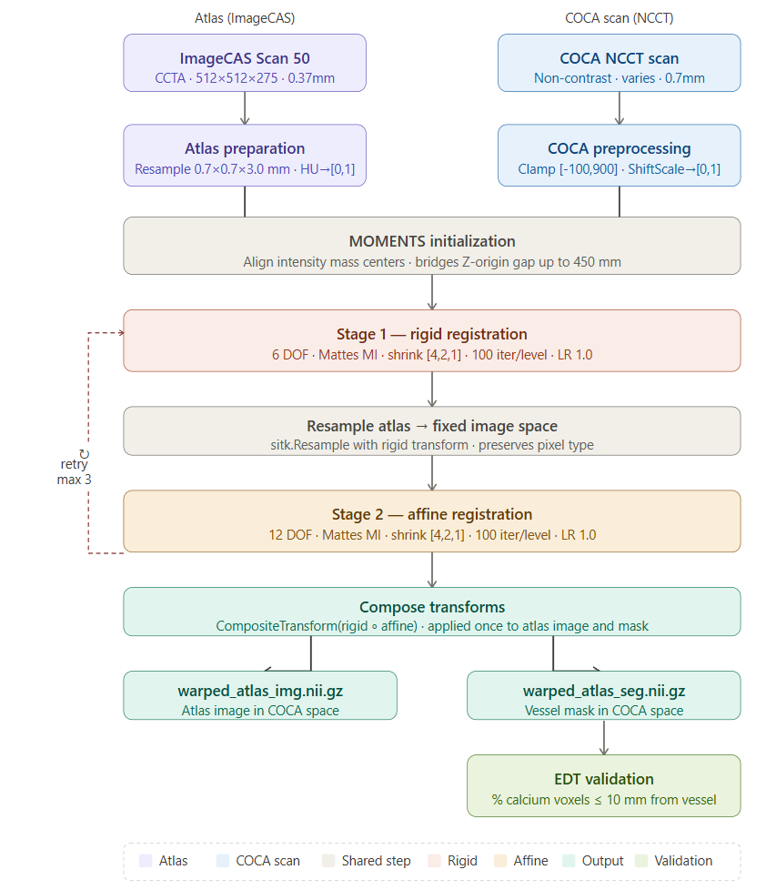
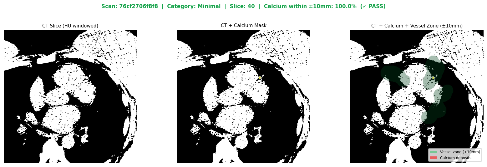
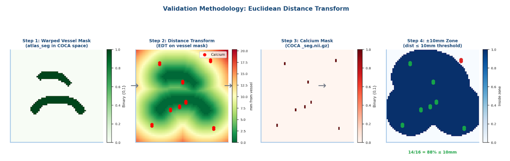
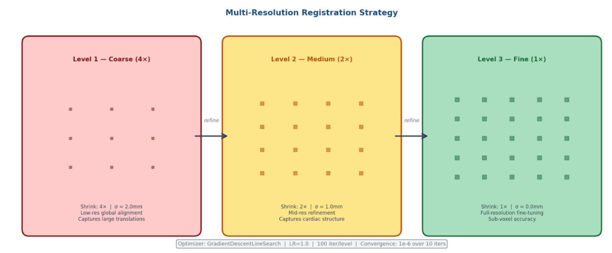

# PrediCT — Coronary Atlas Registration Pipeline
### GSoC 2026 Pre-Task · Project 3: Physics-Informed Plaque Growth Simulation

[](https://www.python.org/)
[](https://simpleitk.org/)
[](https://pytorch.org/)
[](LICENSE)

---

A two-part pipeline for cardiac CT preprocessing and coronary atlas registration, developed as the pre-task submission for the GSoC 2026 PrediCT project. Part 1 preprocesses the COCA calcium scoring dataset and builds a PyTorch DataLoader. Part 2 registers an ImageCAS CCTA coronary atlas to 30 non-contrast CT scans and validates anatomical proximity of registered vessel territories to real calcium deposits.


*Full registration pipeline — atlas and COCA scans are preprocessed independently, aligned via MOMENTS initialisation, registered through two sequential stages, and the composite transform is applied to the vessel mask for validation.*


## Results

### Part 2 — Experiment 3 (Best Run, Atlas: ImageCAS Scan 50, n=30)

| Metric | Minimal | Mild | Moderate | Severe | Overall |
|--------|---------|------|----------|--------|---------|
| Scans | 7 | 7 | 7 | 9 | 30 |
| Passing > 70% | 6/7 (86%) | 5/7 (71%) | 2/7 (29%) | 4/9 (44%) | **17/30 (57%)** |
| Mean % ≤ 10 mm | 85.7% | 78.8% | 54.6% | 58.0% | **68.5%** |
| Median % ≤ 10 mm | — | — | — | — | **71.6% ✓** |
| Mean dist to vessel | 5.6 mm | 5.9 mm | 10.7 mm | 10.2 mm | **8.3 mm** |
| Time per scan | — | — | — | — | **22.1 s** |
| Total time | — | — | — | — | **11.1 min** |

> **Median of 71.6% meets the >70% target.** The gap between low- and high-burden categories reflects coronary remodelling in advanced CAC disease — a biological constraint independent of pipeline quality, documented in the [justification write-up](docs/justification.docx).

## Installation

```bash
# Clone the repository
git clone https://github.com/ubadaht/prediCT-project3-testTask.git
cd predict-gsoc2026

# Create and activate conda environment
conda create -n predict python
conda activate predict

# Install dependencies
pip install -r requirements.txt
```
---

## Data Setup

### COCA Dataset (Part 1 + Part 2)

Download from the [COCA Kaggle page](https://www.kaggle.com/datasets/khoongweihao/coronary-calcium-and-chest-ct-dataset)

### ImageCAS Dataset (Part 2 atlas)

Download from the [ImageCAS Kaggle page](https://www.kaggle.com/datasets/xiaoweixumedicalai/imagecas). The archive is split across `.change2zip` + `.z01–.z04` files — rename to `.zip` and extract with WinRAR or 7-Zip.

Expected naming: `{N}.img.nii.gz` and `{N}.label.nii.gz` for scans 1–200.

### Update Paths

All scripts read paths from constants defined at the top of each file. Update these to match your local setup before running:

```python
# Example — registration.py
SPLIT_CSV  = Path(r"C:\...\COCA_output\data_canonical\tables\split_index.csv")
RESAMPLED  = Path(r"C:\...\COCA_output\data_resampled")
ATLAS_IMG  = Path(r"C:\...\COCA_output\atlas\atlas_img.nii.gz")
```

---

## Part 1 — COCA Preprocessing

Processes 787 COCA scans into a normalised, stratified dataset with a PyTorch DataLoader.

### Run the full pipeline

```bash
cd COCA_scripts
python COCA_pipeline.py
```

This executes all steps in sequence:

| Step | Script | Output |
|------|--------|--------|
| 1. Unnest | `unnester.py` | Flat directory of raw scans |
| 2. Canonicalise | `COCA_processor.py` | RAS orientation, canonical format |
| 3. Resample | `COCA_resampler.py` | 0.7 × 0.7 × 3.0 mm spacing |
| 4. HU window | `hu_windowing.py` | Clamp [−100, 900] → scale [0, 1] |
| 5. Split | `stratified_split.py` | Train 70% / Val 15% / Test 15% |
| 6. Statistics | `dataset_statistics.py` | HTML report + console summary |
| 7. PDF report | `pdf_report.py` | PDF |

### Dataset statistics (post-processing)

| Split | Scans | Zero CAC | Minimal | Mild | Moderate | Severe |
|-------|-------|----------|---------|------|----------|--------|
| Train | 550 | 237 | 81 | 100 | 65 | 67 |
| Val   | 118 | 51  | 17 | 21  | 14 | 15 |
| Test  | 119 | 52  | 17 | 22  | 14 | 14 |

### DataLoader

```python
from coca_dataloader import CachedCOCADataset, get_dataloader

train_loader = get_dataloader(split="train", batch_size=8, augment=True)
val_loader   = get_dataloader(split="val",   batch_size=8, augment=False)
```

**Augmentation pipeline** (training only):

| Transform | Parameters | Probability |
|-----------|------------|-------------|
| Horizontal flip | — | p = 0.50 |
| Vertical flip | — | p = 0.50 |
| Rotation | ± 15° | p = 0.50 |
| Zoom scaling | 0.85 – 1.15× | p = 0.30 |
| Gaussian noise | σ = 0.05 | p = 0.20 |
| Intensity scaling | ± 10% | p = 0.20 |

Probabilities are conservative for clinically meaningful transforms — HU-altering augmentations use low p to avoid corrupting the > 130 HU calcium threshold.

---

## Part 2 — Atlas Registration

Registers an ImageCAS CCTA coronary atlas to 30 non-contrast COCA scans and validates anatomical proximity of the warped vessel mask to real calcium deposits.

### Step 1 — Prepare atlas

```bash
python atlas_preparation.py
```

Resamples ImageCAS Scan 50 to 0.7 × 0.7 × 3.0 mm and windows HU values to [0, 1].

```
Output:
  COCA_output/atlas/atlas_img.nii.gz   — (269, 269, 46), float32, [0,1]
  COCA_output/atlas/atlas_seg.nii.gz   — (269, 269, 46), binary {0,1}, 4,368 vessel voxels
```

### Step 2 — Register (Experiment 3 — full pipeline)

```bash
python experiment3.py
```

Registers atlas to all 30 candidates and validates. Runtime ~11 minutes on CPU.

```
Output:
  experiment3_output/registration/{scan_id}/
    transform_rigid.tfm
    transform_affine.tfm
    warped_atlas_img.nii.gz
    warped_atlas_seg.nii.gz
    registration_meta.json

  experiment3_output/
    registration_results.csv
    validation_results.csv
    experiment3_report.png
```

### Step 3 — Validate only

```bash
python validation.py
```

Runs EDT-based validation on an existing set of registered outputs. Produces per-scan overlays and a 4-panel summary figure.

---

## Experiments

### Experiment 1 — Baseline (ImageCAS Scan 100)

Scan 100 was selected as the initial atlas based on having the highest vessel voxel count (137,547 pre-resampling) among candidates inspected — a coverage-based heuristic.

```bash
python registration.py   # uses COCA_output/atlas/ (Scan 100)
python validation.py
```

| Metric | Value |
|--------|-------|
| Scans registered | 24 / 25 |
| Mean % ≤ 10 mm | 50.4% |
| Median % ≤ 10 mm | 44.0% |
| Mean dist to vessel | 12.9 mm |
| Mean time per scan | 15.7 s |

### Experiment 2 — Atlas candidate comparison

Evaluates 4 atlas candidates (Scans 1, 10, 50, 100) on an 8-scan representative subset to find the best atlas using three principled criteria: registration success rate, mean MI metric (population compatibility), and mean calcium-to-vessel distance.

```bash
python experiment2.py
```

| Atlas | Success | Mean % ≤ 10 mm | Mean \|MI\| | Mean dist | Selected |
|-------|---------|----------------|------------|-----------|----------|
| Scan 1 | 5/8 | 70.6% | 0.213 | 10.2 mm | ✗ |
| Scan 10 | 6/8 | 42.4% | 0.241 | 11.1 mm | ✗ |
| **Scan 50** | **8/8** | **66.5%** | **0.245** | **8.7 mm** | **✓** |
| Scan 100 | 7/8 | 55.2% | 0.173 | 12.9 mm | ✗ |

Scan 50 was selected for perfect registration stability (8/8), highest population MI compatibility (0.245), and lowest mean distance. Scan 1's nominally higher mean % is inflated — computed over only 5 successful registrations.

### Experiment 3 — Full pipeline (Scan 50, n=30)

```bash
python experiment3.py
```

## Example


---

## Validation


*Four-step validation: (1) warped vessel mask, (2) Euclidean Distance Transform assigning each voxel its distance in mm to the nearest vessel, (3) calcium mask, (4) within-threshold zone. Green = pass, red = fail.*

Validation uses a Euclidean Distance Transform (EDT) approach:

```python
from scipy.ndimage import distance_transform_edt

# Compute distance from every voxel to nearest vessel voxel
dist_map_mm = distance_transform_edt(
    1 - vessel_binary,
    sampling=[spacing_z, spacing_y, spacing_x]   # physical mm
)

# Validation metric
ca_distances = dist_map_mm[calcium_binary == 1]
pct_within_10mm = 100.0 * (ca_distances <= 10.0).sum() / len(ca_distances)
```

**Verification:** On scan `530977324f9e` (Moderate, reported 16.5%), the minimum calcium-to-vessel distance is 0.0 mm (some calcium is directly on vessels), mean is 17.9 mm, and within-10mm count is 142/861 — matching the reported figure exactly.

### Run the validation notebook

```bash
cd COCA_scripts
jupyter notebook
# open docs/validation_notebook.ipynb
```

The notebook covers registration timing, per-scan validation bars, per-category boxplots, distance CDF, scatter plots, visual overlays, and the full results table.

---

### Registration parameters

```python
REG_PARAMS = {
    "metric"                  : "MattesMutualInformation",
    "num_histogram_bins"      : 50,
    "sampling_percentage"     : 0.10,
    "random_seed"             : 42,
    "optimizer"               : "GradientDescentLineSearch",
    "learning_rate"           : 1.0,
    "num_iterations"          : 100,
    "convergence_min_value"   : 1e-6,
    "convergence_window_size" : 10,
    "shrink_factors"          : [4, 2, 1],
    "smoothing_sigmas"        : [2.0, 1.0, 0.0],
    "max_retries"             : 3,
}
```

### Multi-resolution strategy


*Three pyramid levels progressively refine registration from coarse global alignment (4× shrink, σ = 2 mm) to full-resolution fine-tuning (1× shrink, σ = 0 mm).*


## Citation / Acknowledgements

**Datasets:**
- COCA: [Kaggle — Coronary Calcium and Chest CT Dataset](https://www.kaggle.com/datasets/khoongweihao/coronary-calcium-and-chest-ct-dataset)
- ImageCAS: Zhu et al. "ImageCAS: A Large-Scale Dataset and Benchmark for Coronary Artery Segmentation." 2023. [Kaggle link](https://www.kaggle.com/datasets/xiaoweixumedicalai/imagecas)

**Key references:**
- Mattes et al. "Nonrigid multimodality image registration." SPIE Medical Imaging 2001.
- Steinman et al. "Flow imaging and computing: large artery haemodynamics." Ann Biomed Eng 2005.
- Stone et al. "Prediction of progression of coronary artery disease and clinical outcomes using vascular profiling of endothelial shear stress and arterial plaque characteristics." Circulation 2012.

---

## Author

**Ubadah Tanveer** — GSoC 2026 Applicant, PrediCT Project 3  
Pre-task submission · March 2026
